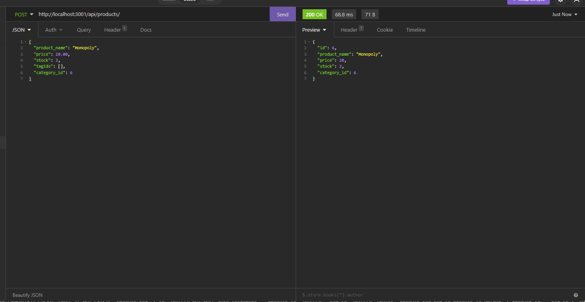

# E-Commerce Backend

## Description

This database program allows you to keep track of information on various products. You have tables set up with categories which will tell you all the products inside of that category, as well as tables for products and tags that the products will have. When viewing products you will see all the info on which category they are a part of and what tags they have. When viewing tags you will view what products have these tags. You can update the products with new information or tags and you can update the tags with new information and products. You can update the categories with different names as well. You may also delete any categories, products, or tags.

## Table of Contents

* [Technologies](#technologies)
* [Installation](#installation)
* [Usage](#usage)
* [Questions](#questions)
* [License](#license)

## Technologies

| Technology | Link |
| -------- | ------|
| HTML |   |
| Javascript |    |
| Node.js | https://nodejs.org/en/ |
| npm | https://www.npmjs.com/ |

## Installation

In order to install clone the git repository, then run an npm install. Then to set up the database go into mysql and type in source schema.sql or whatever the file path is to schema.sql, like db/schema.sql if you are in the root directory of the project. From there you need to create a .env file with the DB_NAME set to ecommerce_db, the DB_USER set to your mysql user, in my case root, and the DB_PW set to the user's password. From there we can now seed the db by running 'npm run seed' which will create the tables and some defualt entries into the db. Finally we can now run the code at any time by running npm start.

## Usage

Link to video: https://www.youtube.com/watch?v=UeVpnL5QYuo

When you start the program after just having run the installation instructions you will have entries already in the database. We can run a get request to any of the categories, products or tags. We can get all categories, products, or tags, or we can just get a single item from any of the options. All we would have to do to get one result to show is to put an id number for what we want in the url of the get request. Here is the response we get for getting all products after running the seeding program:  

  

We can create any of a category, product or tag. We just have to ssend a post request with the body containing the correct information. For a category we just need to send a category name. For a product we need to send product name, stock, price. We can optionally also give a category id and any tags in a tagIds array. For tags all we need is the tag name and optionally any productIds that we want to connect this tag too. Here is an example post request to create a product:  

  

We created a product but didn't give it any tag ids. We can now create a tag id and give that product as something that will be tagged as our new tag. This is what it would look like after adding a created tag to the product:  

  

When we update any of a category, product or tag, we can just send a put request to /api/(what is upated)/(id of what we are updating). In the json body we just enter whatever we are editing. We could add more connections between tags and products here just by doing a tagIds set to an array of tags, or productIds seet to an array of products. Here is an example request of editing the product name of the product we created earlier:  

  

Here is the overall info of the product we have created:  

  

Finally we can delete any category, product, or tag. Just send a delete request with the id in the URL. Then the thing being deleted will be removed from the database and any connection it has to other products/tags/categories will also be removed. This is the final view of the product when the family friendly tag has been removed:  

  

## Questions
If you have any questions you can reach me at:  
Github: cmwschroeder  
Github link: https://github.com/cmwschroeder  
Email: cmwschroeder@gmail.com

## License

Licensed under the [MIT License](LICENSE)